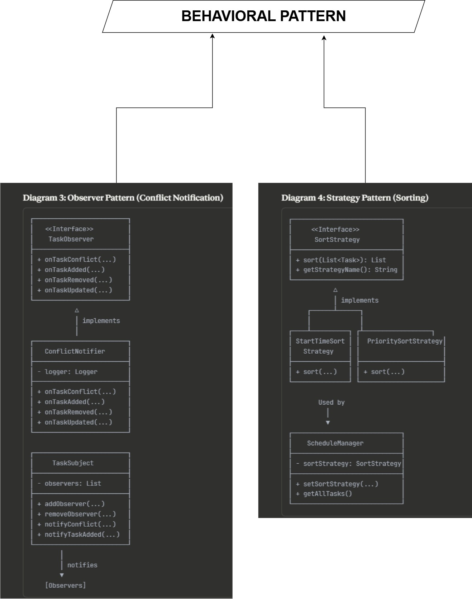
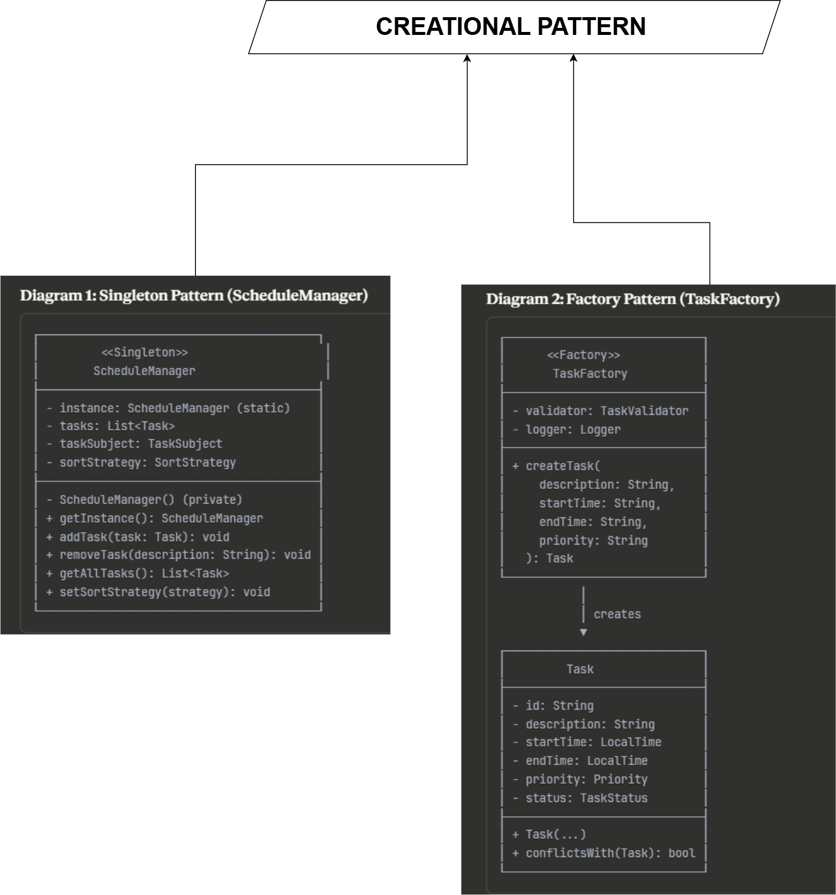
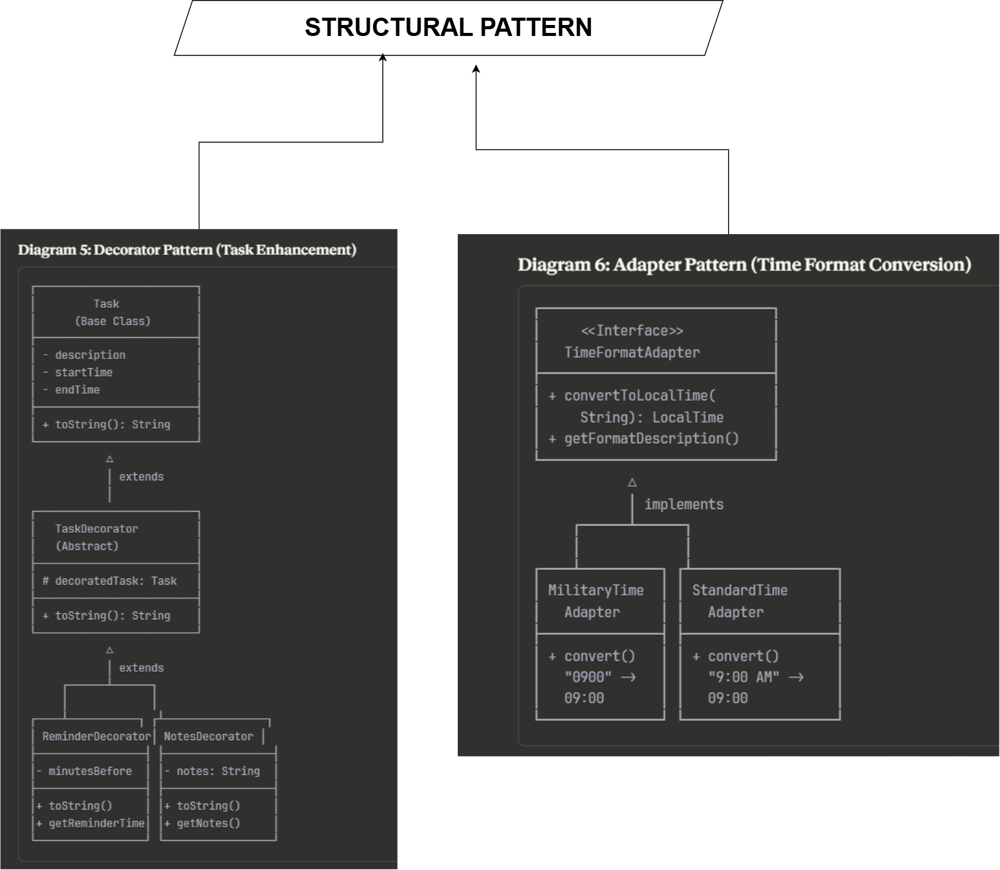

# Astronaut Daily Schedule Organizer

A console-based task management application demonstrating advanced Java design patterns and SOLID principles.  
This project was created as part of an educational exercise to showcase how real-world scheduling problems can be solved with clean architecture and reusable patterns.

## Features
- Create, view, and manage daily astronaut tasks from the console.
- Automatic conflict detection and notifications.
- Flexible sorting of tasks by different criteria.
- Support for multiple time formats (12-hour and 24-hour).
- Extensible task features like reminders and notes.

## Design Patterns Implemented

---

### Behavioral Patterns  

#### 1. Observer Pattern – Task Conflict Notification System  

- **Purpose:** Implements a publish–subscribe mechanism so that multiple parts of the program can be notified when a task conflict happens without tight coupling.  
- **How it works here:**  
  - `TaskSubject` (the schedule) maintains a list of observers.  
  - Observers implement `TaskObserver` and get notified automatically.  
  - `ConflictNotifier` is a concrete observer sending alerts to the user.  
- **Benefit:** New notification mechanisms (email, console message, logs) can be added without touching the core task scheduling code.  
- **Location:** `com.astronaut.patterns.behavioral.observer`

#### 2. Strategy Pattern – Dynamic Task Sorting  

- **Purpose:** Allows selecting different sorting algorithms for tasks at runtime without changing client code.  
- **How it works here:**  
  - `SortStrategy` interface defines the contract.  
  - `StartTimeSortStrategy` sorts tasks chronologically.  
  - `PrioritySortStrategy` sorts by priority.  
  - `ScheduleManager` can switch strategies dynamically.  
- **Benefit:** Adding a new sort order (e.g., by duration) requires only a new strategy class.  
- **Location:** `com.astronaut.patterns.behavioral.strategy`

---

### Creational Patterns  

#### 3. Singleton Pattern – Schedule Manager  
- **Purpose:** Ensure only one instance of the schedule manager exists globally.  
- **How it works here:**  
  - `ScheduleManager` uses double-checked locking to be thread-safe.  
  - All modules access scheduling functions through this single instance.  
- **Benefit:** Prevents inconsistent state from multiple schedulers and centralizes task management.  
- **Location:** `com.astronaut.patterns.creational.singleton.ScheduleManager`

#### 4. Factory Pattern – Task Creation with Validation  
- **Purpose:** Encapsulate the logic of constructing valid `Task` objects.  
- **How it works here:**  
  - `TaskFactory` takes raw input, validates it via `TaskValidator`, and returns a proper `Task`.  
  - If validation fails, it throws a descriptive error.  
- **Benefit:** All tasks are created in one place with consistent validation, making the code easier to maintain.  
- **Location:** `com.astronaut.patterns.creational.factory`

---

### Structural Patterns  

#### 5. Decorator Pattern – Enhanced Task Features  
- **Purpose:** Add new features (reminders, notes) to tasks without changing the base `Task` class.  
- **How it works here:**  
  - `TaskDecorator` is an abstract wrapper for `Task`.  
  - `ReminderDecorator` adds reminder capability.  
  - `NotesDecorator` adds note-taking capability.  
- **Benefit:** Features can be combined at runtime (a task can have both notes and reminders) without exploding subclasses.  
- **Location:** `com.astronaut.patterns.structural.decorator`

#### 6. Adapter Pattern – Multiple Time Format Support  
- **Purpose:** Allow the system to work with multiple time formats by converting them to a standard internal format.  
- **How it works here:**  
  - `TimeAdapter` interface defines conversion.  
  - `MilitaryTimeAdapter` converts times like 1430.  
  - `StandardTimeAdapter` converts 9:00 AM to the internal format.  
- **Benefit:** Core scheduling code only deals with one time format while supporting multiple user inputs.  
- **Location:** `com.astronaut.patterns.structural.adapter`
